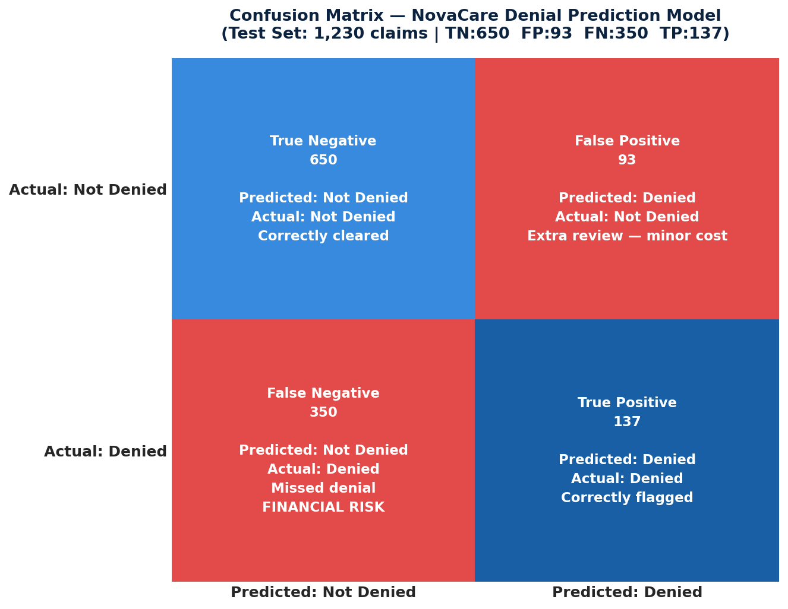

# 🤖 NovaCare Insurance — Claim Denial Prediction Model

**Stella Obase| Dataverse Africa Internship, Cohort 4.0 | May 2026**

---

## 📌 Project Overview

NovaCare Insurance was losing **$7.22 million annually** to claim denials — with a 39.58% denial rate, 4–8× the industry benchmark. The billing team only discovered denials *after* submission, leaving no opportunity to intervene.

This project builds a **Logistic Regression model** that assigns every claim a denial probability score before submission. Claims scoring above 0.5 are flagged as high-risk for pre-submission review — shifting NovaCare from reactive damage control to proactive revenue protection.

This is the **fourth and final phase** of the NovaCare Claims project, built on top of the SQL cleaning and Python pattern analysis completed in the previous phase.

**Tools Used:** Python (Scikit-learn · Pandas · Matplotlib · Seaborn) · PostgreSQL · Power BI

---

## 📂 Repository Structure

```
novacare-denial-prediction/
│
├── README.md
│
├── notebook/
│   └── Novacare_denial_prediction.ipynb      ← Full ML pipeline (cleaning → model → outputs)
│
├── data/
│   └── novacare_predictions.xlsx             ← All 6,150 claims scored with model outputs
│
├── visuals/
│   ├── confusion_matrix_final.png            ← Colour-coded confusion matrix (test set)
│   └── feature_importance.png               ← Top 10 features driving denial predictions
│
├── reports/
│   ├── NovaCare_Model_Summary.pdf            ← Model methodology & performance summary
│   └── NovaCare_Model_Analysis.pdf          ← Three-model comparative analysis report
│
└── dashboard/
    └── Team_3_Claims_Visuals.pbix            ← Power BI dashboard (4-page interactive)
```

---

## 🔁 Project Pipeline

```
Stage 1 — SQL Data Cleaning
        ↓ 6,150 claims cleaned, 8 flag columns added
Stage 2 — Python Pattern Analysis
        ↓ Denial drivers identified by department, provider, payer
Stage 3 — Predictive Modelling (this repo)
        ↓ Logistic Regression trained, 3 configurations tested
Stage 4 — Power BI Dashboard
        ↓ 4-page interactive dashboard for CFO presentation
```

---

## 🧠 Model Architecture

| Parameter | Value |
|---|---|
| Algorithm | Logistic Regression |
| Solver | `lbfgs` |
| Max Iterations | 1,000 |
| Class Weight | `balanced` — compensates for 40/60 class imbalance |
| Train / Test Split | 80% / 20% — stratified on `is_denied` |
| Scaling | `StandardScaler` on 6 continuous columns |
| Encoding | One-hot (department, payer_type) + Label (provider, ICD, CPT) |
| Decision Threshold | 0.5 — claims above this are flagged high-risk |
| Random State | 42 (fixed for reproducibility) |

Logistic Regression was chosen for its **native interpretability** — each feature receives a coefficient showing direction and magnitude of influence on denial risk. In a healthcare billing context, stakeholders must be able to understand and trust the model's reasoning.

---

## 🔧 Feature Engineering

### Columns Dropped (Data Leakage Prevention)
A critical rule in predictive modelling is avoiding **data leakage** — using information that would only be available *after* a denial occurs. The following columns were excluded:

| Column Dropped | Reason |
|---|---|
| `claim_status` | Direct source of the target variable |
| `denial_reason` | Only exists after a denial occurs |
| `allowed_amount` | Set by insurer post-adjudication |
| `paid_amount` | Only known after payment decision |
| `is_pending` | 100% correlated with `claim_status = Pending` |
| `paid_error`, `date_error` | Audit flags derived after submission |
| `claim_id`, `patient_id`, `encounter_id` | Unique identifiers — no generalizable signal |

### New Features Engineered

| Feature | Description |
|---|---|
| `is_denied` | Target variable — 1 if `claim_status = Denied`, else 0 |
| `submission_month` | Integer month extracted from submission date |
| `is_peak_month` | 1 if month is March or August (highest-denial months) |
| `is_high_value` | 1 if `billed_amount` exceeds dataset median ($2,924.48) |
| `provider_denial_rate` | Each provider's historical denial rate — captures the Dr. Okafor signal |
| `denial_probability` | Model output — predicted probability of denial (0.0–1.0) |
| `high_denial_risk` | 1 if `denial_probability ≥ 0.5` — the actionable pre-submission flag |
| `confusion_quadrant` | TP / TN / FP / FN label per claim — used for Power BI matrix colouring |
| `data_split` | Train or Test tag — used to filter Power BI confusion matrix |

---

## 📊 Model Performance — Final Model (Model A)

| Metric | Value |
|---|---|
| Accuracy | **63.98%** |
| Recall (Denied class) | **28.13%** |
| Precision (Denied class) | **59.57%** |
| F1 Score | **0.3821** |
| ROC-AUC | **0.5760** |

### Confusion Matrix — Test Set (1,230 Claims)

|  | Predicted: Not Denied | Predicted: Denied |
|---|---|---|
| **Actual: Not Denied** | ✅ TN: 650 — Correctly cleared | ⚠️ FP: 93 — Extra review (minor cost) |
| **Actual: Denied** | ❌ FN: 350 — Missed denial (**FINANCIAL RISK**) | ✅ TP: 137 — Correctly flagged |



### Financial Impact of Model Performance

| Metric | Value |
|---|---|
| High-risk claims flagged (full dataset) | 1,237 |
| Total value of flagged claims | $3,683,942 |
| Value of correctly caught denials (137 TP) | $401,059 |
| Estimated leakage from missed denials (350 FN) | $1,040,539 |

---

## 🔍 Feature Importance — What Drives Denials?

.png)

| Feature | Coefficient | Business Interpretation |
|---|---|---|
| `is_duplicate_claim` | +2.900 | Strongest predictor — duplicates denied at 92% |
| `department_Internal Medicine` | -0.161 | Lower risk — well-documented claims |
| `payer_type_Self_Pay` | +0.108 | Self-Pay payers deny at 40.6% — above average |
| `department_Pediatrics` | +0.107 | Complex age-specific billing requirements |
| `department_Emergency` | +0.081 | Unplanned visits often lack prior authorization |
| `is_peak_month` | +0.075 | High volume in March/August increases error rate |
| `provider_denial_rate` | +0.068 | Historical denial rate is a reliable forward signal |
| `days_to_submit` | +0.059 | Late submission causes Timely Filing denials |

---

## ⚖️ Three Models Compared

Three configurations were tested before selecting the final model:

| Metric | Model A ✅ Final | Model B | Model C |
|---|---|---|---|
| Dataset | Full (6,150) | Full (6,150) | No duplicates (5,670) |
| ICD Description | Included | Excluded | Included |
| Accuracy | **63.98%** | 63.41% | 50.53% |
| Recall | 28.13% | 30.39% | **48.12%** |
| Precision | **59.57%** | 57.14% | 35.16% |
| F1 Score | 0.3821 | 0.3968 | 0.4063 |
| ROC-AUC | **0.5760** | 0.5761 | 0.4982 |
| High-Risk Flagged | **1,237** | 1,356 | 2,799 |
| FN Leakage Estimate | $1.04M | $1.01M | N/A |

**Why Model A was selected:**
- Highest accuracy (63.98%) and precision (59.57%) — most reliable flags for the billing team
- Fewest false alarms (93 FP vs 111 in Model B, 2,799 in Model C)
- Reflects NovaCare's real claims environment — duplicate claims are a genuine operational problem worth modelling
- AUC identical to Model B (0.5760 vs 0.5761) — adding ICD description did not degrade discrimination

> Model C achieved the highest recall (48.12%) but flagged 2,799 claims (49% of the dataset) as high-risk at only 35% precision — operationally impractical for a billing team.

---

## 📦 Model Outputs Delivered

| File | Contents |
|---|---|
| `novacare_predictions.xlsx` | All 6,150 claims with `denial_probability`, `high_denial_risk`, `confusion_quadrant`, `data_split` |
| `confusion_matrix_final.png` | Colour-coded 2×2 confusion matrix (test set) |
| `feature_importance.png` | Top 10 features ranked by absolute coefficient |
| `novacare_lr_model.pkl` | Saved trained model for future claim scoring |
| `novacare_scaler.pkl` | Saved StandardScaler for consistent future preprocessing |

---

## ⚠️ Model Limitations & Next Steps

**Current Limitations**
- Recall of 28.13% means the model misses ~7 in 10 actual denials — a baseline result for Logistic Regression on this data
- AUC of 0.5760 is only marginally above random, limiting use as a ranking tool
- Label encoding for high-cardinality columns (provider, ICD, CPT) introduces implicit ordinal relationships that don't exist
- Static model — requires periodic retraining as payer mix and coding practices change

**Recommended Next Steps**
- Upgrade to **Random Forest or XGBoost** — expected to improve recall by 15–25 percentage points
- **Tune decision threshold** — lowering from 0.5 to 0.35 would catch more denials at the cost of more false alarms
- **Separate models per department** — Emergency and Pediatrics have distinct denial patterns that a single model cannot fully capture
- **Monthly retraining** — schedule retraining on each new month's claims
- Add `denial_reason` as a training feature once the current cohort's outcomes are recorded

---

## 🛠️ Skills Demonstrated

- End-to-end machine learning pipeline in Python (data prep → feature engineering → modelling → evaluation → export)
- Data leakage prevention and feature selection rationale
- Logistic Regression with class imbalance handling (`class_weight='balanced'`)
- Multi-model comparative evaluation (accuracy, recall, precision, F1, ROC-AUC)
- Financial impact quantification from model outputs
- Feature importance interpretation for non-technical stakeholders
- Power BI integration of model predictions
- Executive-level reporting of ML findings

---

## 🔗 Related Projects

This project is the final phase of a four-part NovaCare series:

| Phase | Project | Focus |
|---|---|---|
| Phase 1 | NovaCare Claims — SQL Cleaning | Data quality & standardisation |
| Phase 2 | NovaCare Claims — Python Analysis | Denial pattern analysis |
| Phase 3 | NovaCare Claims — CFO Memo & Dashboard | Executive reporting |
| **Phase 4** | **NovaCare Denial Prediction (this repo)** | **Predictive ML model** |

---

## 👩‍💻 About


*Project focus: Building NovaCare's first data-driven denial prediction capability — from raw claims data to a scored, actionable pre-submission risk model.*
